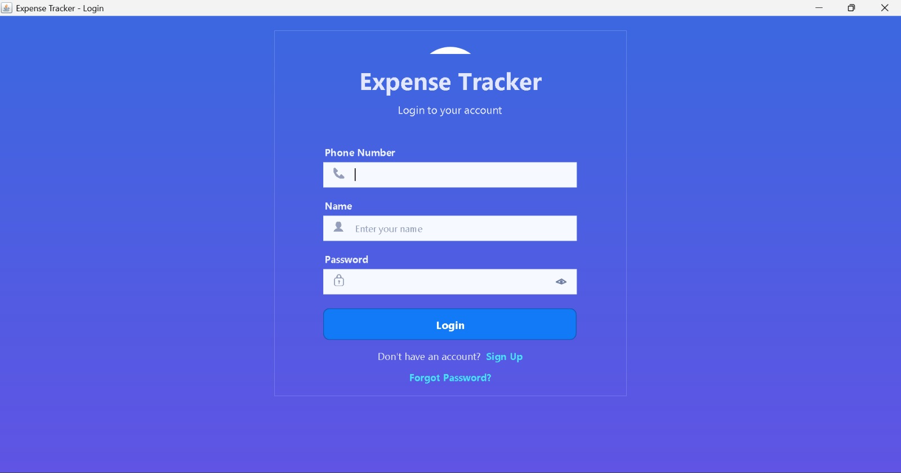
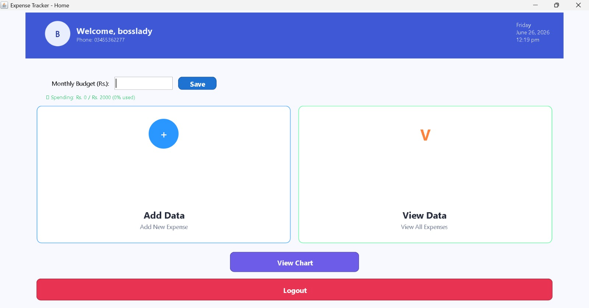
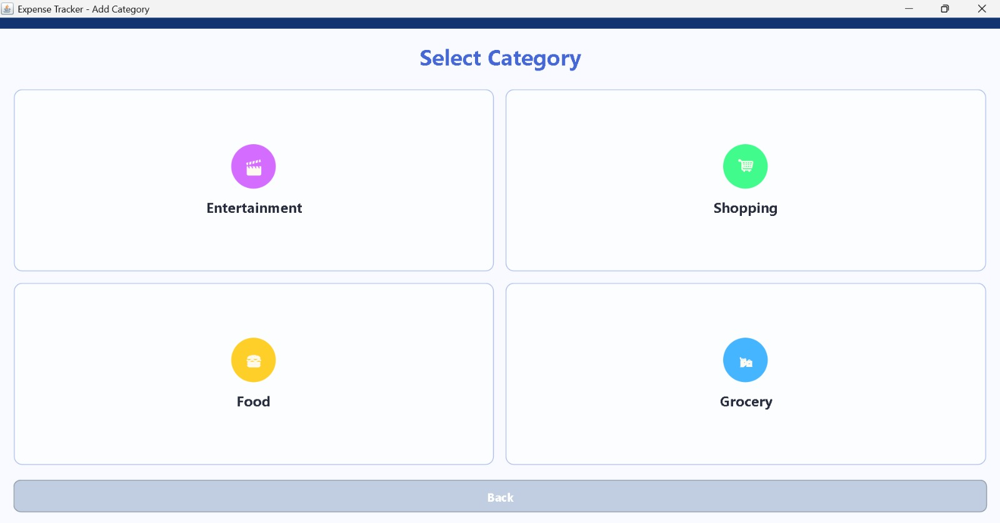
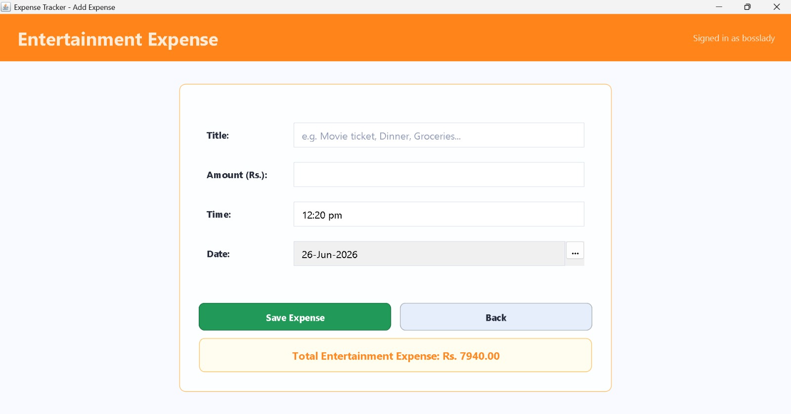
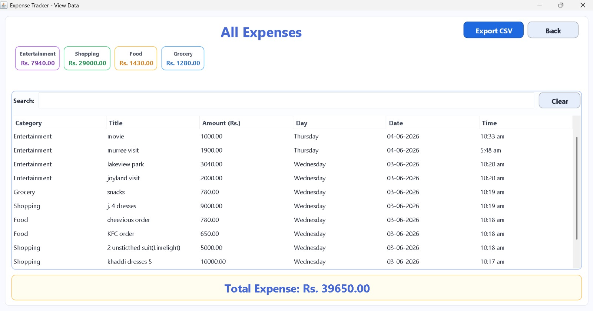
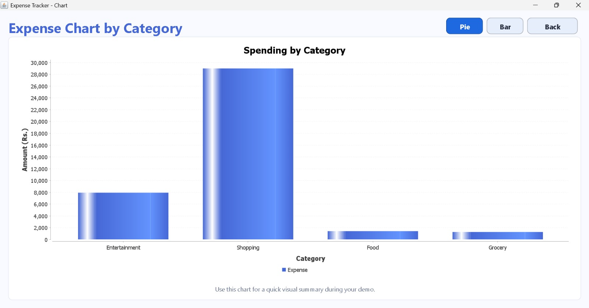
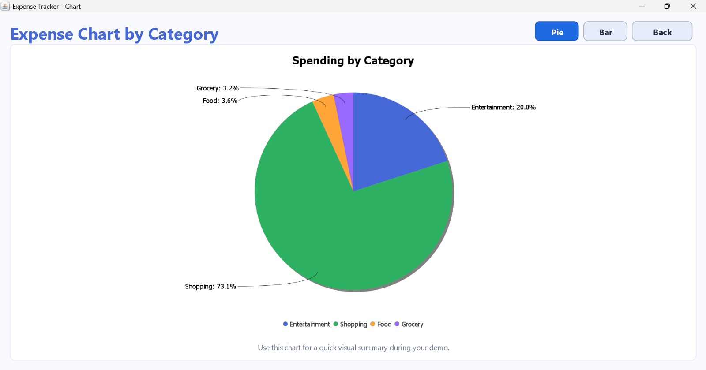
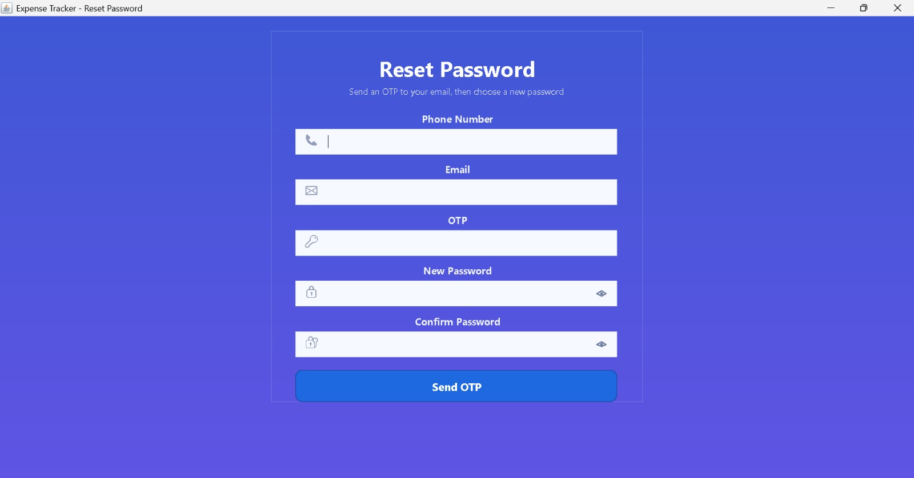
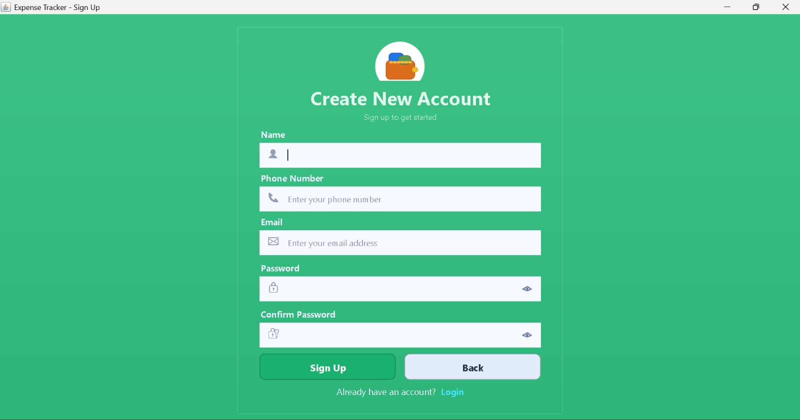

# Expenses-Tracker-WebApp

## Overview
The Expenses Tracker App is a secure, locally-run financial management desktop solution built with Java and SQLite. It provides user authentication, detailed expense tracking, monthly budget monitoring, and email-based OTP/password reset functionality. All data is stored locally in `expenses.db`, ensuring fast performance and complete privacy while maintaining enterprise-grade security practices like SHA-256 password hashing and environment-based credential management.

## Technologies Used
- Java (SE 11+)
- Java Swing (Desktop UI)
- SQLite & JDBC (Local Database)
- JavaMail API (SMTP Email Integration)
- SHA-256 (Secure Password Hashing)
- `.env` Configuration Management
- Maven/Gradle (Optional for dependency management)

## Features
- 🔐 **Secure Authentication**: Signup/login via phone & email with SHA-256 hashed passwords
- 💰 **Expense CRUD**: Add, view, edit, and delete expenses with categories, titles, and timestamps
- 📅 **Advanced Filtering**: View expenses by day, month, year, or custom date ranges
- 📊 **Budget Tracking**: Set monthly budgets, track spending percentage, and get real-time usage metrics
- 📧 **Email Integration**: OTP verification and password reset via SMTP (configured via `.env`)
- 🎨 **Category Management**: Default & custom categories with optional icon support
- 🧪 **Built-in Smoke Test**: Quick utility to verify database schema and auth flows
- 🛡️ **Privacy-First**: Zero cloud dependencies – all data stays on your machine

## Getting Started
### Prerequisites
- Java Development Kit (JDK) 11 or higher
- SQLite JDBC Driver & JavaMail API (`javax.mail`)
- IDE: IntelliJ IDEA, Eclipse, or VS Code with Java extensions

### Installation & Setup
1. **Clone the Repository**
   ```bash
   git clone https://github.com/your-username/Expenses-Tracker-WebApp.git
   cd Expenses-Tracker-WebApp
Configure Email Credentials (Optional but Recommended)
Create a .env file in the project root:

env

APP_SMTP_USER=your_email@gmail.com
APP_SMTP_PASS=your_16_digit_app_password
⚠️ For Gmail: Enable 2-FA → Google Account → Security → App Passwords → Generate a 16-digit password.

Build & Run
Using IDE (Recommended):

Open the project folder in IntelliJ/Eclipse/VS Code
Run com.expensetracker.Main directly
Using Command Line:

Bash

javac -cp ".:sqlite-jdbc-x.x.x.jar:javax.mail-x.x.x.jar" -d out com/expensetracker/*.java
java -cp ".:out:sqlite-jdbc-x.x.x.jar:javax.mail-x.x.x.jar" com.expensetracker.Main
First Launch

The app auto-creates expenses.db and required tables
The login screen appears. Create your first account to start tracking!

Screenshots












Project Structure
text

com.expensetracker/
├── Main.java          # App entry point & UI launcher
├── DBHelper.java      # SQLite schema, migrations & CRUD operations
├── EmailUtil.java     # SMTP email & OTP handling
└── SmokeTest.java     # Quick DB & auth verification script
Contributions
Contributions are welcome! If you find a bug, have a feature request, or want to improve the UI/documentation, feel free to:

🐛 Open an Issue
🌿 Create a Pull Request
📝 Suggest improvements in Discussions
